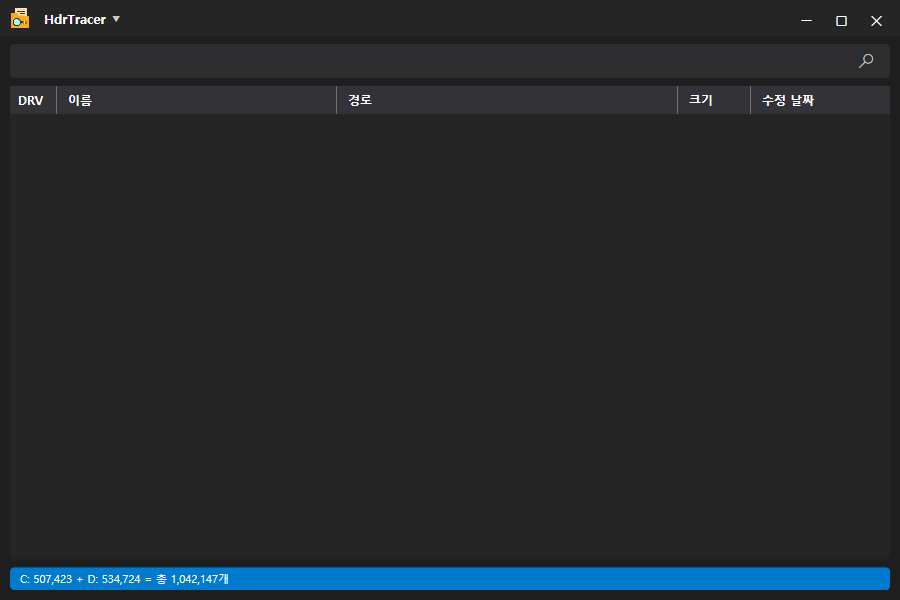
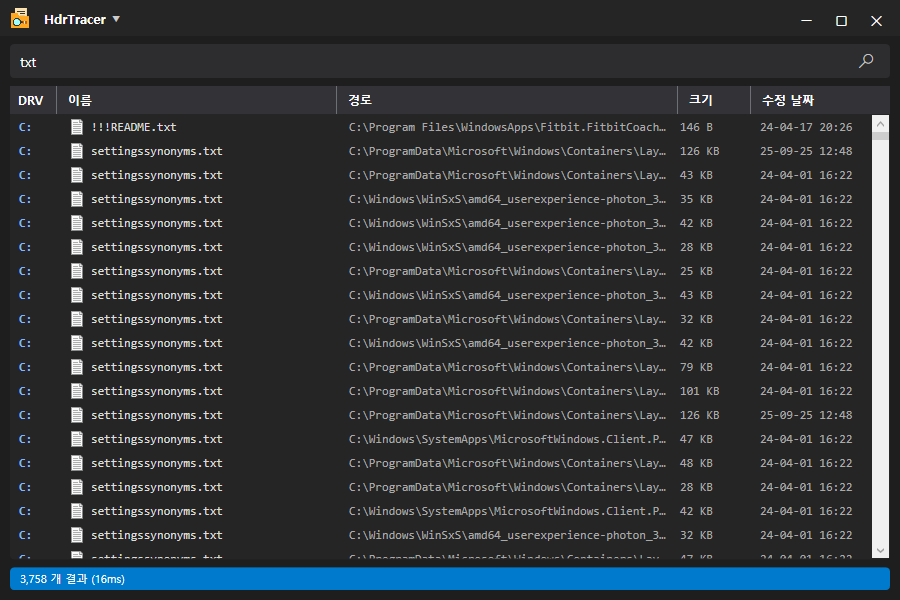

# HdrTracer

한국어 | [English](README.en.md)

NTFS 드라이브의 파일을 이름으로 빠르게 찾는 윈도우용 검색 도구.

## 기능

- 파일 이름 / 확장자로 검색 (`*.jpg`, `*.png` 같은 패턴 지원)
- 여러 드라이브 동시 검색 (C, D 등 고정 디스크 + USB)
- USN 저널 기반 실시간 반영 — 파일을 추가/삭제/이름변경하면 결과에 바로 반영
- USB를 꽂거나 빼면 검색 결과 자동으로 갱신
- 우클릭으로 파일 열기 / 폴더에서 보기 / 경로 복사
- 트레이에 배치 (닫아도 다시 열면 즉시 뜸)
- 다크 테마, 한국어 / 영어 지원

## 요구 사항

- 64비트 윈도우 (Windows 11)
- NTFS 파일 시스템 (FAT32, exFAT는 인덱싱 안 됨)
- 관리자 권한

### 관리자 권한이 필요한 이유

MFT와 USN 저널을 직접 읽으려면 볼륨에 대한 낮은 수준의 접근 권한이 필요함.
그래서 실행할 때마다 UAC 창이 한 번 나타남.

## 설치

[릴리스](../../releases/latest)에서 `HdrTracer_Setup_*.exe`를 받아 실행.

설치 파일이나 실행 파일은 코드 서명이 되어 있지 않아서,
처음 실행할 때 "Windows의 PC 보호" (SmartScreen) 경고가 한 번 뜰 수 있음.
추가 정보 → 실행을 누르면 진행됨.

.NET 런타임이 포함되어 있어서 따로 설치할 것이 없음.

## 사용법

1. 실행하면 연결된 NTFS 드라이브를 인덱싱 (처음 한 번, 드라이브 크기에 따라 몇 초).
2. 검색창에 파일 이름이나 확장자를 입력하고 Enter.

### 숨김·시스템 항목

탐색기에서 안 보이는 숨김·시스템 속성 항목(예: 백신이 만드는 보호 폴더, NTFS 내부 파일)은
기본적으로 검색 결과에서 제외. 설정에서 "숨김·시스템 항목 표시"를 켜면 결과에 포함.

## 설정

- 이동식 드라이브(USB) 인덱싱 on/off
- 닫기 버튼 동작 (트레이로 숨김 / 종료)
- 숨김·시스템 항목 표시

## 알림

- NTFS 전용. 다른 파일 시스템은 인덱싱하지 않음.
- 파일 내용 검색은 안 됨. 이름과 경로만 검색함.
- 코드 서명이 없어서 SmartScreen 경고가 나타남.

## 라이선스

코드는 MIT 라이선스를 따른다.

앱 아이콘은 [Muhammad_Usman](https://www.flaticon.com/)이 제작한 것으로,
[Flaticon](https://www.flaticon.com/)에서 받았다 (출처 표기 조건의 무료 사용).
